<div align="center">

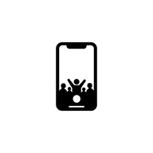

# Concert Thing

**A private, multi-tenant archive for concert photos and videos, with automatic song recognition, adaptive streaming, and shareable show pages.**

Built on Cloudflare's edge stack, with a React web app and a native Expo companion that keeps uploading in the background.

[**Live app →**](https://shows.krejzac.cz)


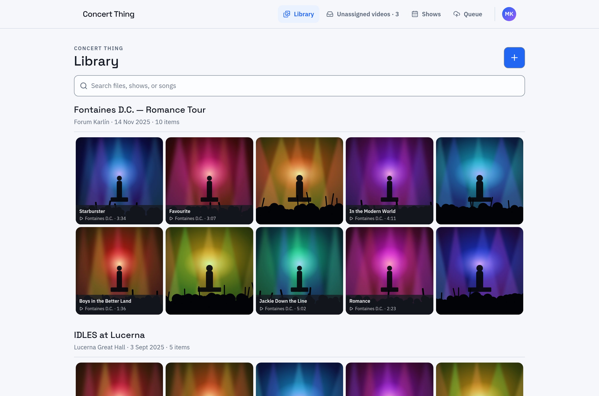

</div>

## Why

After a concert, your phone holds dozens of multi-hundred-megabyte clips with names like `IMG_4810.MOV`. Concert Thing turns them into an organised archive. Uploads are matched to the right show from their capture timestamps, every video is scanned for the songs it contains, and you can share a whole show with friends through one link, without making the rest of your library public.

## Screenshots

<table>
  <tr>
    <td width="50%">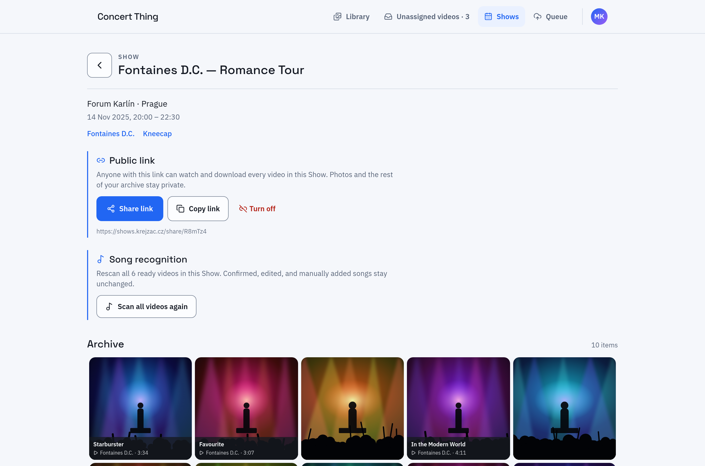<br /><sub><b>Show page</b>: artists, revocable public link, bulk song re-scan</sub></td>
    <td width="50%">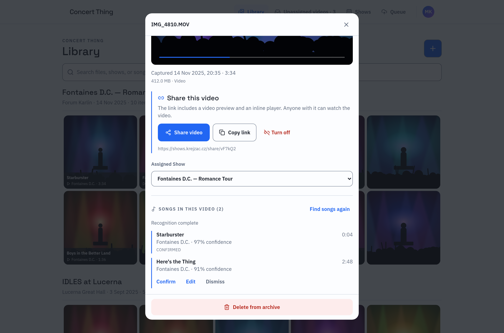<br /><sub><b>Song review</b>: timestamped matches to confirm, edit, or dismiss</sub></td>
  </tr>
  <tr>
    <td width="50%">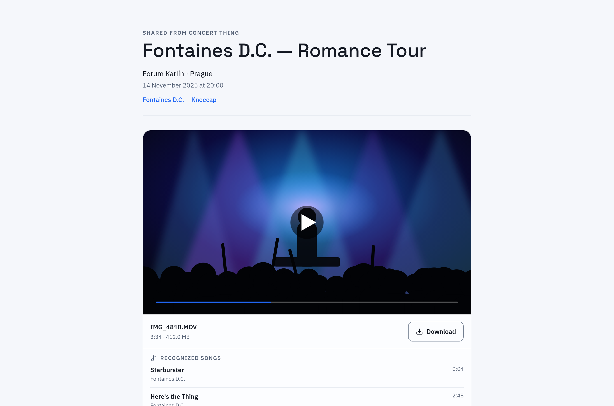<br /><sub><b>Public share page</b>: signed Stream playback and original downloads, no account needed</sub></td>
    <td width="50%">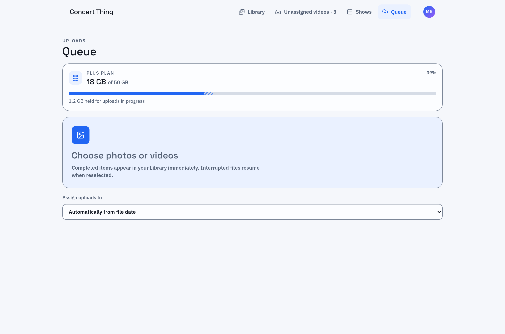<br /><sub><b>Upload queue</b>: storage allowance with reserved in-flight bytes</sub></td>
  </tr>
  <tr>
    <td width="50%">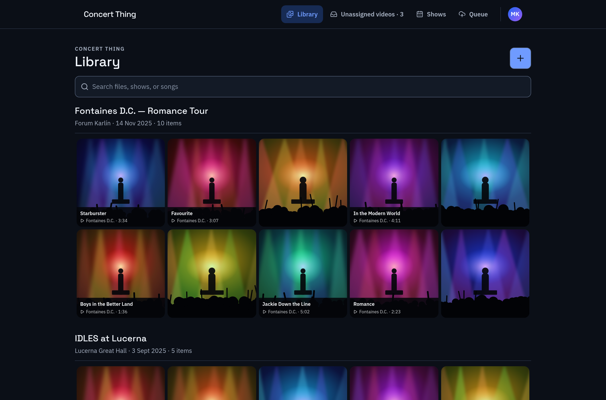<br /><sub><b>Dark mode</b>: follows the system colour scheme</sub></td>
    <td width="50%">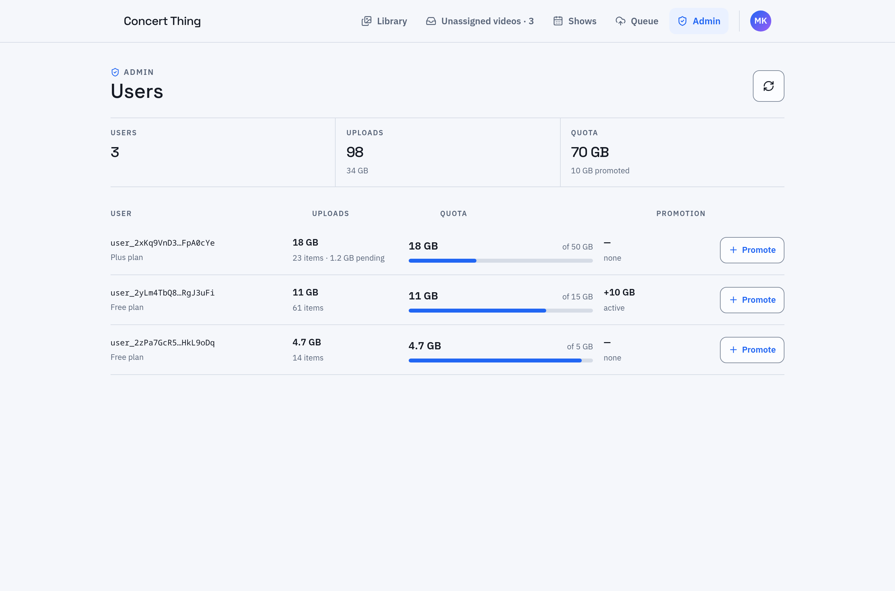<br /><sub><b>Admin panel</b>: per-user usage and additive storage grants</sub></td>
  </tr>
</table>

<p align="center">
  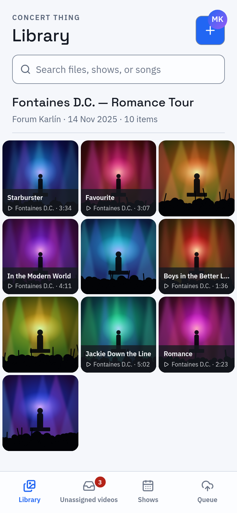
  &nbsp;&nbsp;
  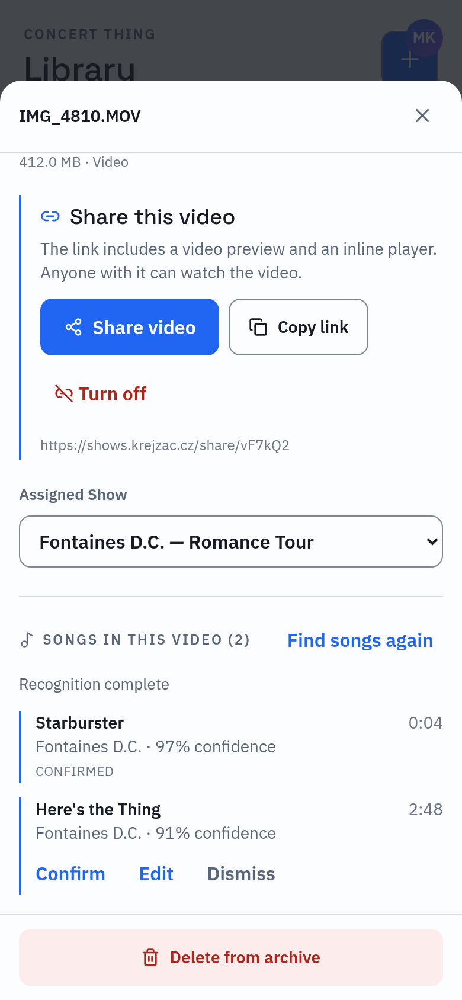
</p>

> Screenshots use generated demo data. See [Regenerating screenshots](#regenerating-screenshots).

## Features

- **Resumable uploads at scale.** 8 MiB multipart uploads stream directly to R2, two files run concurrently, interrupted files resume, and SHA-256 hashing rejects duplicate videos before any bytes are sent.
- **Automatic show assignment.** Capture times from MP4 metadata or file timestamps are matched against show windows. Ambiguous media goes to an *Unassigned videos* inbox, and an owner's manual choice always overrides automatic assignment.
- **Song recognition.** Every video is submitted asynchronously to ACRCloud. Matches come back with timestamps and confidence and can be confirmed, edited, rejected, or added by hand. The library is searchable by song and artist.
- **Adaptive streaming.** Originals stay private in R2. Cloudflare Stream transcodes them for adaptive playback behind short-lived signed tokens, and the app falls back to authenticated R2 range requests while encoding is still running.
- **Sharing.** Revocable, unguessable links work for a whole show or a single video. Visitors can watch, see the recognized setlist, and download originals. Photos, other shows, and owner controls stay private.
- **Multi-tenant accounts and quotas.** Clerk authentication on web and mobile (including native Sign in with Apple), strict per-account isolation, and per-owner storage allowances with atomic reservations, plan tiers, and additive grants managed from an admin panel.
- **Native mobile companion.** An Expo app with a durable SQLite upload queue and a custom Kotlin background-upload module that keeps transferring while the app is suspended.
- **Installable PWA** with a responsive layout that also works on phones, plus automatic dark mode.

## Architecture

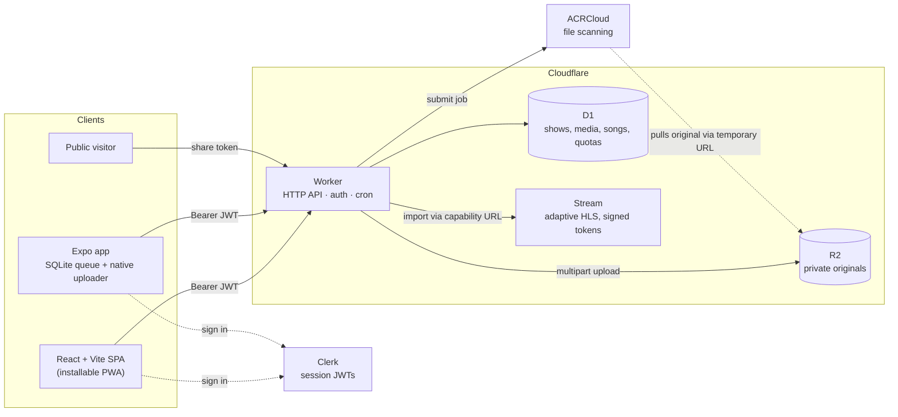

The Worker's HTTP interface is the only seam between clients and storage, and D1, R2, and Stream bindings never leave the server modules. An hourly cron retries abandoned uploads and deletions, cleans Stream derivatives, and reconciles storage counters.

## Engineering highlights

- **Idempotent, crash-safe uploads.** The mobile queue persists every item in SQLite and sends an account-scoped `clientUploadId`, so a lost response never produces a duplicate. Items blocked by quota keep their local copy and wait for an explicit retry rather than looping in the background.
- **Race-free quota enforcement.** In-flight uploads reserve their declared size through conditional D1 updates, so several parallel uploads cannot overshoot an allowance. Reservations expire after seven idle days, and usage is released only after R2 confirms that an original has been deleted.
- **Provider-neutral recognition.** ACRCloud sits behind a `RecognitionProvider` interface. Jobs are idempotent and retried once, and re-runs only update *pending* candidates, so confirmed, edited, or manual decisions are never overwritten.
- **Original bytes never leave private storage.** ACRCloud and Stream receive temporary, unguessable capability URLs rather than public objects. Public pages get short-lived signed Stream tokens, and downloads go through an explicit action.
- **Tenant isolation is tested.** A dedicated test suite covers cross-account access to shows, media, uploads, playback, recognition, and share links.

## Tech stack

| Layer | Technology |
| --- | --- |
| Web client | React, TypeScript, Vite, Tailwind CSS, lucide-react |
| API | Cloudflare Workers (TypeScript), cron triggers |
| Data | Cloudflare D1 (SQLite) with 11 versioned migrations |
| Media | Cloudflare R2 (multipart), Cloudflare Stream (adaptive HLS, signed URLs) |
| Auth | Clerk (web, Expo, native Apple sign-in), JWT verification at the edge |
| Recognition | ACRCloud File Scanning |
| Mobile | Expo SDK 57, React Native, Expo Router, NativeWind, expo-sqlite, custom Kotlin module |

## Project structure

```text
src/client/               React web app
  api.ts                  HTTP adapter used by every feature
  Archive.tsx             Library, Shows, inbox, and queue views
  PublicShow.tsx          Public share page
  AdminPanel.tsx          User usage and storage grants
  components/             Show, upload, media, sharing, and Song Match modules
src/server/               Worker implementation
  router.ts               HTTP routes
  auth.ts                 Clerk verification and legacy-archive claiming
  media.ts                Ingestion, assignment, search, and playback
  storage.ts              Allowances, reservations, and reconciliation
  sharing.ts              Show and video share links
  recognition/            Provider-neutral recognition + ACRCloud adapter
src/worker.ts             Cloudflare entry point
migrations/               D1 schema history
mobile/                   Expo companion app (see mobile/README.md)
test/                     Upload, auth, tenancy, sharing, storage, and recognition tests
scripts/screenshots/      Mocked demo server + Playwright capture for README images
```

## Getting started

Requirements: Node.js, pnpm, and a Cloudflare account with D1, R2, and Stream enabled.

```bash
pnpm install
pnpm test          # unit and integration tests
pnpm run check     # tests + type check + production build
```

Configure secrets interactively. Never put values in source or shell history:

```bash
wrangler secret put CLERK_JWT_KEY
wrangler secret put ACRCLOUD_ACCESS_TOKEN
wrangler secret put ACRCLOUD_CONTAINER_ID
```

The web build reads `VITE_CLERK_PUBLISHABLE_KEY` from `.env.local`. To apply migrations and deploy:

```bash
pnpm exec wrangler d1 migrations apply concert-thing --remote
pnpm run deploy
```

### Mobile companion

```bash
pnpm --filter concert-thing-mobile run typecheck
pnpm --filter concert-thing-mobile test
pnpm --filter concert-thing-mobile exec expo run:ios   # or expo run:android
```

Native background transfers need a development build. See [`mobile/README.md`](mobile/README.md) for setup, Android JDK requirements, and local EAS builds.

### Termux

Wrangler's local runtime does not support Android/Termux. Install with `pnpm install --ignore-scripts`, then run `pnpm run termux:shim` before `check` or `deploy`. The shim allows remote Wrangler commands only.

### Regenerating screenshots

The screenshots come from the real React components, rendered against a mocked API with generated artwork:

```bash
pnpm run screenshots:serve   # demo server on http://localhost:5199
PLAYWRIGHT_CORE=/path/to/playwright-core CHROMIUM=/usr/bin/chromium-browser \
  node scripts/screenshots/capture.mjs
```

## Behaviour notes

- **Assignment.** Media is assigned automatically only when its timestamp falls inside exactly one show. A show without an end time gets a conservative six-hour window, and overlapping or unmatched windows leave the item unassigned.
- **Storage.** Each owner has one decimal-byte allowance, made up of the plan base plus active grants. Only completed originals count as usage. An owner who goes over the allowance keeps access to the library, but new uploads are blocked.
- **Legacy data.** The first Clerk account to sign in claims the pre-Clerk archive exactly once. Later accounts start with empty, isolated libraries.
